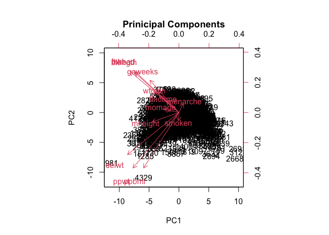
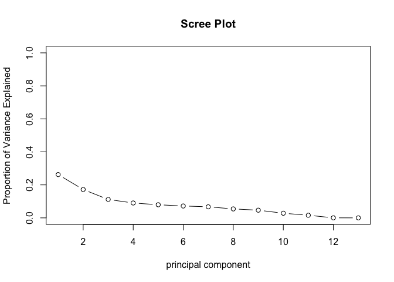
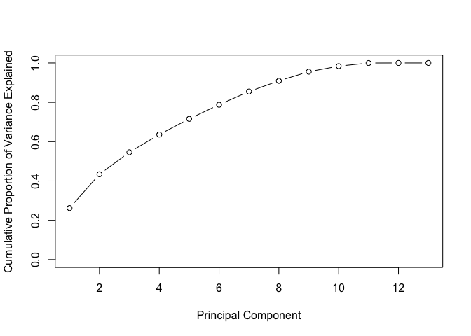
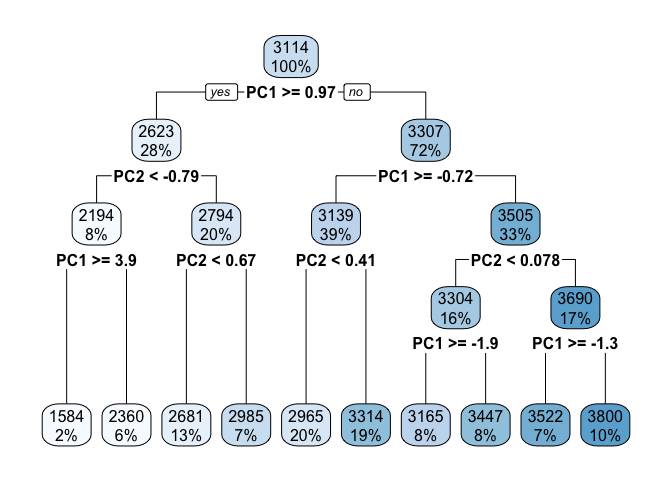

Birthweight PCA Example
================

### Prinicipal component analysis example

``` r
bwt_df_pca =
 read_csv("./birthweight.csv") %>%
  select(-frace, -mrace, -babysex, -malform, -pnumlbw, -pnumsga, -parity)
```

    ## Rows: 4342 Columns: 20
    ## ── Column specification ────────────────────────────────────────────────────────
    ## Delimiter: ","
    ## dbl (20): babysex, bhead, blength, bwt, delwt, fincome, frace, gaweeks, malf...
    ## 
    ## ℹ Use `spec()` to retrieve the full column specification for this data.
    ## ℹ Specify the column types or set `show_col_types = FALSE` to quiet this message.

``` r
skimr::skim(bwt_df_pca)
```

|                                                  |            |
|:-------------------------------------------------|:-----------|
| Name                                             | bwt_df_pca |
| Number of rows                                   | 4342       |
| Number of columns                                | 13         |
| \_\_\_\_\_\_\_\_\_\_\_\_\_\_\_\_\_\_\_\_\_\_\_   |            |
| Column type frequency:                           |            |
| numeric                                          | 13         |
| \_\_\_\_\_\_\_\_\_\_\_\_\_\_\_\_\_\_\_\_\_\_\_\_ |            |
| Group variables                                  | None       |

Data summary

**Variable type: numeric**

| skim_variable | n_missing | complete_rate |    mean |     sd |     p0 |     p25 |     p50 |     p75 |   p100 | hist  |
|:--------------|----------:|--------------:|--------:|-------:|-------:|--------:|--------:|--------:|-------:|:------|
| bhead         |         0 |             1 |   33.65 |   1.62 |  21.00 |   33.00 |   34.00 |   35.00 |   41.0 | ▁▁▆▇▁ |
| blength       |         0 |             1 |   49.75 |   2.72 |  20.00 |   48.00 |   50.00 |   51.00 |   63.0 | ▁▁▁▇▁ |
| bwt           |         0 |             1 | 3114.40 | 512.15 | 595.00 | 2807.00 | 3132.50 | 3459.00 | 4791.0 | ▁▁▇▇▁ |
| delwt         |         0 |             1 |  145.57 |  22.21 |  86.00 |  131.00 |  143.00 |  157.00 |  334.0 | ▅▇▁▁▁ |
| fincome       |         0 |             1 |   44.11 |  25.98 |   0.00 |   25.00 |   35.00 |   65.00 |   96.0 | ▃▇▅▂▃ |
| gaweeks       |         0 |             1 |   39.43 |   3.15 |  17.70 |   38.30 |   39.90 |   41.10 |   51.3 | ▁▁▂▇▁ |
| menarche      |         0 |             1 |   12.51 |   1.48 |   0.00 |   12.00 |   12.00 |   13.00 |   19.0 | ▁▁▂▇▁ |
| mheight       |         0 |             1 |   63.49 |   2.66 |  48.00 |   62.00 |   63.00 |   65.00 |   77.0 | ▁▁▇▂▁ |
| momage        |         0 |             1 |   20.30 |   3.88 |  12.00 |   18.00 |   20.00 |   22.00 |   44.0 | ▅▇▂▁▁ |
| ppbmi         |         0 |             1 |   21.57 |   3.18 |  13.07 |   19.53 |   21.03 |   22.91 |   46.1 | ▃▇▁▁▁ |
| ppwt          |         0 |             1 |  123.49 |  20.16 |  70.00 |  110.00 |  120.00 |  134.00 |  287.0 | ▅▇▁▁▁ |
| smoken        |         0 |             1 |    4.15 |   7.41 |   0.00 |    0.00 |    0.00 |    5.00 |   60.0 | ▇▁▁▁▁ |
| wtgain        |         0 |             1 |   22.08 |  10.94 | -46.00 |   15.00 |   22.00 |   28.00 |   89.0 | ▁▁▇▁▁ |

``` r
bwt_pca =
  prcomp(bwt_df_pca, scale =TRUE, center = TRUE, rext = T)
```

    ## Warning: In prcomp.default(bwt_df_pca, scale = TRUE, center = TRUE, rext = T) :
    ##  extra argument 'rext' will be disregarded

``` r
names(bwt_pca) 
```

    ## [1] "sdev"     "rotation" "center"   "scale"    "x"

``` r
summary(bwt_pca)
```

    ## Importance of components:
    ##                           PC1    PC2    PC3     PC4     PC5    PC6     PC7
    ## Standard deviation     1.8467 1.4950 1.2053 1.08277 1.01689 0.9674 0.93352
    ## Proportion of Variance 0.2623 0.1719 0.1118 0.09018 0.07954 0.0720 0.06704
    ## Cumulative Proportion  0.2623 0.4343 0.5460 0.63620 0.71574 0.7877 0.85477
    ##                            PC8     PC9    PC10    PC11    PC12      PC13
    ## Standard deviation     0.83974 0.77862 0.60462 0.45525 0.06112 1.525e-15
    ## Proportion of Variance 0.05424 0.04663 0.02812 0.01594 0.00029 0.000e+00
    ## Cumulative Proportion  0.90902 0.95565 0.98377 0.99971 1.00000 1.000e+00

``` r
biplot(bwt_pca, main = "Prinicipal Components", scale = 0)
```

<!-- -->

``` r
pca_var  =
  bwt_pca$sdev ^ 2

pca_var
```

    ##  [1] 3.410209e+00 2.235106e+00 1.452865e+00 1.172400e+00 1.034058e+00
    ##  [6] 9.359415e-01 8.714674e-01 7.051566e-01 6.062442e-01 3.655662e-01
    ## [11] 2.072507e-01 3.736008e-03 2.326509e-30

``` r
scree =
  pca_var/ sum(pca_var)

scree
```

    ##  [1] 2.623238e-01 1.719312e-01 1.117588e-01 9.018462e-02 7.954290e-02
    ##  [6] 7.199550e-02 6.703595e-02 5.424282e-02 4.663417e-02 2.812047e-02
    ## [11] 1.594236e-02 2.873853e-04 1.789622e-31

``` r
plot(scree, xlab = "principal component",
            ylab = "Proportion of Variance Explained",
            ylim = c(0, 1), type = "b",
            main = "Scree Plot")
```

<!-- -->

``` r
plot(cumsum(scree),
    xlab = "Principal Component",
    ylab = "Cumulative Proportion of Variance Explained",
    ylim = c(0, 1), type = "b")
```

<!-- -->

``` r
which(cumsum(scree) >= 0.9)[1]
```

    ## [1] 8

``` r
train.data =
  data.frame(bwt = bwt_df_pca$bwt, bwt_pca$x[, 1:4])

rpart.model = 
  rpart(bwt ~ .,
                    data = train.data, method = "anova")
 
rpart.plot(rpart.model)
```

<!-- -->

**not the best for our data based on scree plot. had to drop important
varaibles such as race and sex.**
