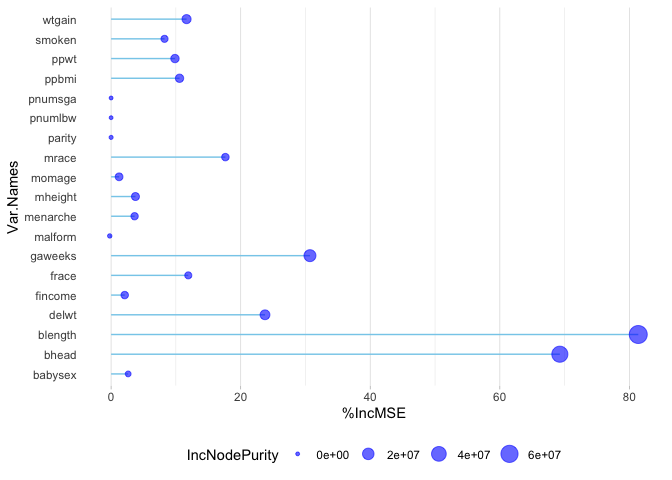

Birthweight PCA Example
================

### Prinicipal component analysis example

``` r
bwt_df_pca =
 read_csv("./birthweight.csv") %>%
  select(-frace, -mrace, -babysex, -malform, -pnumlbw, -pnumsga, -parity)
```

    ## Rows: 4342 Columns: 20
    ## ── Column specification ────────────────────────────────────────────────────────
    ## Delimiter: ","
    ## dbl (20): babysex, bhead, blength, bwt, delwt, fincome, frace, gaweeks, malf...
    ## 
    ## ℹ Use `spec()` to retrieve the full column specification for this data.
    ## ℹ Specify the column types or set `show_col_types = FALSE` to quiet this message.

``` r
skimr::skim(bwt_df_pca)
```

|                                                  |            |
|:-------------------------------------------------|:-----------|
| Name                                             | bwt_df_pca |
| Number of rows                                   | 4342       |
| Number of columns                                | 13         |
| \_\_\_\_\_\_\_\_\_\_\_\_\_\_\_\_\_\_\_\_\_\_\_   |            |
| Column type frequency:                           |            |
| numeric                                          | 13         |
| \_\_\_\_\_\_\_\_\_\_\_\_\_\_\_\_\_\_\_\_\_\_\_\_ |            |
| Group variables                                  | None       |

Data summary

**Variable type: numeric**

| skim_variable | n_missing | complete_rate |    mean |     sd |     p0 |     p25 |     p50 |     p75 |   p100 | hist  |
|:--------------|----------:|--------------:|--------:|-------:|-------:|--------:|--------:|--------:|-------:|:------|
| bhead         |         0 |             1 |   33.65 |   1.62 |  21.00 |   33.00 |   34.00 |   35.00 |   41.0 | ▁▁▆▇▁ |
| blength       |         0 |             1 |   49.75 |   2.72 |  20.00 |   48.00 |   50.00 |   51.00 |   63.0 | ▁▁▁▇▁ |
| bwt           |         0 |             1 | 3114.40 | 512.15 | 595.00 | 2807.00 | 3132.50 | 3459.00 | 4791.0 | ▁▁▇▇▁ |
| delwt         |         0 |             1 |  145.57 |  22.21 |  86.00 |  131.00 |  143.00 |  157.00 |  334.0 | ▅▇▁▁▁ |
| fincome       |         0 |             1 |   44.11 |  25.98 |   0.00 |   25.00 |   35.00 |   65.00 |   96.0 | ▃▇▅▂▃ |
| gaweeks       |         0 |             1 |   39.43 |   3.15 |  17.70 |   38.30 |   39.90 |   41.10 |   51.3 | ▁▁▂▇▁ |
| menarche      |         0 |             1 |   12.51 |   1.48 |   0.00 |   12.00 |   12.00 |   13.00 |   19.0 | ▁▁▂▇▁ |
| mheight       |         0 |             1 |   63.49 |   2.66 |  48.00 |   62.00 |   63.00 |   65.00 |   77.0 | ▁▁▇▂▁ |
| momage        |         0 |             1 |   20.30 |   3.88 |  12.00 |   18.00 |   20.00 |   22.00 |   44.0 | ▅▇▂▁▁ |
| ppbmi         |         0 |             1 |   21.57 |   3.18 |  13.07 |   19.53 |   21.03 |   22.91 |   46.1 | ▃▇▁▁▁ |
| ppwt          |         0 |             1 |  123.49 |  20.16 |  70.00 |  110.00 |  120.00 |  134.00 |  287.0 | ▅▇▁▁▁ |
| smoken        |         0 |             1 |    4.15 |   7.41 |   0.00 |    0.00 |    0.00 |    5.00 |   60.0 | ▇▁▁▁▁ |
| wtgain        |         0 |             1 |   22.08 |  10.94 | -46.00 |   15.00 |   22.00 |   28.00 |   89.0 | ▁▁▇▁▁ |

``` r
bwt_pca =
  prcomp(bwt_df_pca, scale =TRUE, center = TRUE, rext = T)
```

    ## Warning: In prcomp.default(bwt_df_pca, scale = TRUE, center = TRUE, rext = T) :
    ##  extra argument 'rext' will be disregarded

``` r
names(bwt_pca) 
```

    ## [1] "sdev"     "rotation" "center"   "scale"    "x"

``` r
summary(bwt_pca)
```

    ## Importance of components:
    ##                           PC1    PC2    PC3     PC4     PC5    PC6     PC7
    ## Standard deviation     1.8467 1.4950 1.2053 1.08277 1.01689 0.9674 0.93352
    ## Proportion of Variance 0.2623 0.1719 0.1118 0.09018 0.07954 0.0720 0.06704
    ## Cumulative Proportion  0.2623 0.4343 0.5460 0.63620 0.71574 0.7877 0.85477
    ##                            PC8     PC9    PC10    PC11    PC12      PC13
    ## Standard deviation     0.83974 0.77862 0.60462 0.45525 0.06112 1.525e-15
    ## Proportion of Variance 0.05424 0.04663 0.02812 0.01594 0.00029 0.000e+00
    ## Cumulative Proportion  0.90902 0.95565 0.98377 0.99971 1.00000 1.000e+00

``` r
biplot(bwt_pca, main = "Prinicipal Components", scale = 0)
```

<!-- -->

``` r
pca_var  =
  bwt_pca$sdev ^ 2
pca_var
```

    ##  [1] 3.410209e+00 2.235106e+00 1.452865e+00 1.172400e+00 1.034058e+00
    ##  [6] 9.359415e-01 8.714674e-01 7.051566e-01 6.062442e-01 3.655662e-01
    ## [11] 2.072507e-01 3.736008e-03 2.326509e-30

``` r
scree =
  pca_var/ sum(pca_var)
scree
```

    ##  [1] 2.623238e-01 1.719312e-01 1.117588e-01 9.018462e-02 7.954290e-02
    ##  [6] 7.199550e-02 6.703595e-02 5.424282e-02 4.663417e-02 2.812047e-02
    ## [11] 1.594236e-02 2.873853e-04 1.789622e-31

``` r
plot(scree, xlab = "principal component",
            ylab = "Proportion of Variance Explained",
            ylim = c(0, 1), type = "b",
            main = "Scree Plot")
```

<!-- -->

``` r
plot(cumsum(scree),
    xlab = "Principal Component",
    ylab = "Cumulative Proportion of Variance Explained",
    ylim = c(0, 1), type = "b")
```

<!-- -->

``` r
which(cumsum(scree) >= 0.9)[1]
```

    ## [1] 8

``` r
train.data =
  data.frame(bwt = bwt_df_pca$bwt, bwt_pca$x[, 1:4])
rpart.model = 
  rpart(bwt ~ .,
                    data = train.data, method = "anova")
 
rpart.plot(rpart.model)
```

<!-- -->

**not the best for our data based on scree plot. had to drop important
varaibles such as race and sex.**

General cleaning

``` r
bwt_df = 
  read_csv("./birthweight.csv") %>% 
  janitor::clean_names() %>%
  mutate(
    babysex = as.factor(babysex),
    babysex = fct_recode(babysex, "male" = "1", "female" = "2"),
    frace = as.factor(frace),
    frace = fct_recode(frace, "white" = "1", "black" = "2", "asian" = "3", 
                       "puerto rican" = "4", "other" = "8"),
    malform = as.logical(malform),
    mrace = as.factor(mrace),
    mrace = fct_recode(mrace, "white" = "1", "black" = "2", "asian" = "3", 
                       "puerto rican" = "4")) 
```

    ## Rows: 4342 Columns: 20
    ## ── Column specification ────────────────────────────────────────────────────────
    ## Delimiter: ","
    ## dbl (20): babysex, bhead, blength, bwt, delwt, fincome, frace, gaweeks, malf...
    ## 
    ## ℹ Use `spec()` to retrieve the full column specification for this data.
    ## ℹ Specify the column types or set `show_col_types = FALSE` to quiet this message.

Adding column ID in order to split data into training and test sets.

``` r
bwt_df =
  tibble::rowid_to_column(bwt_df, "id")

bwt_df
```

    ## # A tibble: 4,342 × 21
    ##       id babysex bhead blength   bwt delwt fincome frace gaweeks malform menar…¹
    ##    <int> <fct>   <dbl>   <dbl> <dbl> <dbl>   <dbl> <fct>   <dbl> <lgl>     <dbl>
    ##  1     1 female     34      51  3629   177      35 white    39.9 FALSE        13
    ##  2     2 male       34      48  3062   156      65 black    25.9 FALSE        14
    ##  3     3 female     36      50  3345   148      85 white    39.9 FALSE        12
    ##  4     4 male       34      52  3062   157      55 white    40   FALSE        14
    ##  5     5 female     34      52  3374   156       5 white    41.6 FALSE        13
    ##  6     6 male       33      52  3374   129      55 white    40.7 FALSE        12
    ##  7     7 female     33      46  2523   126      96 black    40.3 FALSE        14
    ##  8     8 female     33      49  2778   140       5 white    37.4 FALSE        12
    ##  9     9 male       36      52  3515   146      85 white    40.3 FALSE        11
    ## 10    10 male       33      50  3459   169      75 black    40.7 FALSE        12
    ## # … with 4,332 more rows, 10 more variables: mheight <dbl>, momage <dbl>,
    ## #   mrace <fct>, parity <dbl>, pnumlbw <dbl>, pnumsga <dbl>, ppbmi <dbl>,
    ## #   ppwt <dbl>, smoken <dbl>, wtgain <dbl>, and abbreviated variable name
    ## #   ¹​menarche
    ## # ℹ Use `print(n = ...)` to see more rows, and `colnames()` to see all variable names

Splitting data into training and test sets.

``` r
bwt_df_train =
  sample_n(bwt_df, 869)


bwt_df_test = 
  anti_join(bwt_df, bwt_df_train, by = "id")

bwt_df_test =
 bwt_df_test  %>%
  select(-id)


bwt_df_train =
  bwt_df_train %>%
    select(-id)

bwt_df_train
```

    ## # A tibble: 869 × 20
    ##    babysex bhead blength   bwt delwt fincome frace gaweeks malform menarche
    ##    <fct>   <dbl>   <dbl> <dbl> <dbl>   <dbl> <fct>   <dbl> <lgl>      <dbl>
    ##  1 male       35      49  3062   214      25 black    35.7 FALSE         13
    ##  2 female     36      51  3430   133      85 white    41.1 FALSE         14
    ##  3 male       37      54  3770   215      35 white    46.4 FALSE         16
    ##  4 male       34      54  3856   181      35 black    39.1 FALSE         12
    ##  5 female     33      48  2750   135      15 black    40   FALSE         12
    ##  6 female     35      50  3629   150      35 black    42.1 FALSE         14
    ##  7 female     35      53  4054   146      95 white    42.3 FALSE         15
    ##  8 male       34      52  3033   181      35 black    40.1 FALSE         14
    ##  9 male       34      52  3629   164      45 black    38.7 FALSE         14
    ## 10 female     33      50  2608   127      15 black    41.7 FALSE         11
    ## # … with 859 more rows, and 10 more variables: mheight <dbl>, momage <dbl>,
    ## #   mrace <fct>, parity <dbl>, pnumlbw <dbl>, pnumsga <dbl>, ppbmi <dbl>,
    ## #   ppwt <dbl>, smoken <dbl>, wtgain <dbl>
    ## # ℹ Use `print(n = ...)` to see more rows, and `colnames()` to see all variable names

``` r
bwt_df_test
```

    ## # A tibble: 3,473 × 20
    ##    babysex bhead blength   bwt delwt fincome frace gaweeks malform menarche
    ##    <fct>   <dbl>   <dbl> <dbl> <dbl>   <dbl> <fct>   <dbl> <lgl>      <dbl>
    ##  1 male       34      48  3062   156      65 black    25.9 FALSE         14
    ##  2 female     36      50  3345   148      85 white    39.9 FALSE         12
    ##  3 male       34      52  3062   157      55 white    40   FALSE         14
    ##  4 female     34      52  3374   156       5 white    41.6 FALSE         13
    ##  5 female     33      46  2523   126      96 black    40.3 FALSE         14
    ##  6 female     33      49  2778   140       5 white    37.4 FALSE         12
    ##  7 male       33      50  3459   169      75 black    40.7 FALSE         12
    ##  8 female     35      51  3317   130      55 white    43.4 FALSE         13
    ##  9 male       35      51  3459   146      55 white    39.4 FALSE         12
    ## 10 female     35      48  3175   158      75 white    39.7 FALSE         13
    ## # … with 3,463 more rows, and 10 more variables: mheight <dbl>, momage <dbl>,
    ## #   mrace <fct>, parity <dbl>, pnumlbw <dbl>, pnumsga <dbl>, ppbmi <dbl>,
    ## #   ppwt <dbl>, smoken <dbl>, wtgain <dbl>
    ## # ℹ Use `print(n = ...)` to see more rows, and `colnames()` to see all variable names

``` r
y = bwt_df_train$bwt %>% as.tibble()
```

    ## Warning: `as.tibble()` was deprecated in tibble 2.0.0.
    ## Please use `as_tibble()` instead.
    ## The signature and semantics have changed, see `?as_tibble`.
    ## This warning is displayed once every 8 hours.
    ## Call `lifecycle::last_lifecycle_warnings()` to see where this warning was generated.

``` r
x1 = model.matrix(bwt ~ ., bwt_df_train)[,-1] %>% as.tibble()

y_test = bwt_df_test$bwt
x1_test = model.matrix(bwt ~ ., bwt_df_test)[,-1]

rpart.model_pure = 
  rpart(bwt  ~ .,
                    data = bwt_df_train, method = "anova")
 
rpart.plot(rpart.model_pure)
```

<!-- -->

``` r
predicted_dec =
 predict(rpart.model_pure, bwt_df_test, type = 'vector') %>%
  as.tibble

residual_dec =
  predicted_dec - y_test %>%
  as.tibble() 

pred_dec =
  predicted_dec%>%
   rename(prediction = value)

res_dec =
  residual_dec%>%
   rename(residual = value)

fittedvalues_dec =
  bwt_df_test$bwt %>%
  as.tibble


plot_df_dec =
  cbind(fittedvalues_dec, pred_dec, res_dec) %>%
  as.tibble()

plot_df_dec
```

    ## # A tibble: 3,473 × 3
    ##    value prediction residual
    ##    <dbl>      <dbl>    <dbl>
    ##  1  3062      3108.     46.1
    ##  2  3345      3411.     66.1
    ##  3  3062      3183.    121. 
    ##  4  3374      3183.   -191. 
    ##  5  2523      2574.     50.6
    ##  6  2778      2792.     14.2
    ##  7  3459      3183.   -276. 
    ##  8  3317      3624.    307. 
    ##  9  3459      3411.    -47.9
    ## 10  3175      3108.    -66.9
    ## # … with 3,463 more rows
    ## # ℹ Use `print(n = ...)` to see more rows

``` r
rmse_dec = 
  sqrt(mean((plot_df_dec$residual)^2))

rmse_dec
```

    ## [1] 324.611

### Random forest models

``` r
rf.fit <- randomForest(bwt ~ ., data=bwt_df_train, ntree=1000,
                       keep.forest=FALSE, importance=TRUE)
```

``` r
ImpData <- as.data.frame(importance(rf.fit))
ImpData$Var.Names <- row.names(ImpData)

ggplot(ImpData, aes(x=Var.Names, y=`%IncMSE`)) +
  geom_segment( aes(x=Var.Names, xend=Var.Names, y=0, yend=`%IncMSE`), color="skyblue") +
  geom_point(aes(size = IncNodePurity), color="blue", alpha=0.6) +
  theme_light() +
  coord_flip() +
  theme(
    legend.position="bottom",
    panel.grid.major.y = element_blank(),
    panel.border = element_blank(),
    axis.ticks.y = element_blank()
  )
```

<!-- -->
