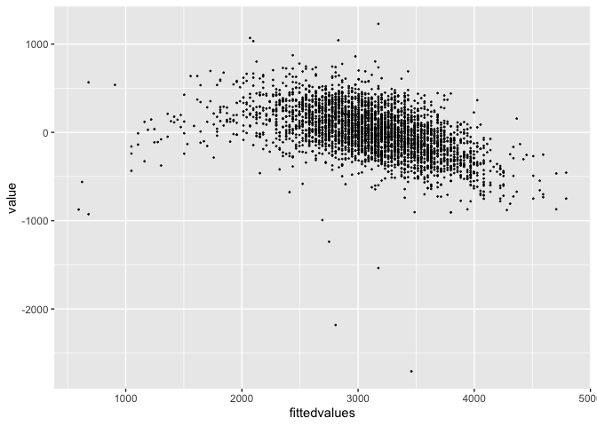

Data Science Homework 6
================
Thirsten Stockton
2022-12-03

# Problem 1

**Code to bring in data**

``` r
weather_df = 
  rnoaa::meteo_pull_monitors(
    c("USW00094728"),
    var = c("PRCP", "TMIN", "TMAX"), 
    date_min = "2017-01-01",
    date_max = "2017-12-31") %>%
  mutate(
    name = recode(id, USW00094728 = "CentralPark_NY"),
    tmin = tmin / 10,
    tmax = tmax / 10) %>%
  select(name, id, everything())
```

    ## Registered S3 method overwritten by 'hoardr':
    ##   method           from
    ##   print.cache_info httr

    ## using cached file: ~/Library/Caches/R/noaa_ghcnd/USW00094728.dly

    ## date created (size, mb): 2022-12-03 16:23:12 (8.428)

    ## file min/max dates: 1869-01-01 / 2022-12-31

***Plotting distribution of bootstapped r-sqaured estimates***

``` r
weather_df %>% 
  modelr::bootstrap(n = 1000) %>% 
  mutate(
    models = map(strap, ~lm(tmax ~ tmin, data = .x) ),
    results = map(models, broom::glance)) %>% 
  select(-strap, -models) %>% 
  unnest(results) %>% 
  ggplot(aes(x = r.squared)) + geom_density()
```

<!-- -->

***95% confidence interval for r-squared estimate***

``` r
rsq_bootstrap =
weather_df %>% 
  modelr::bootstrap(n = 1000) %>% 
  mutate(
    models = map(strap, ~lm(tmax ~ tmin, data = .x) ),
    results = map(models, broom::glance)) %>% 
  select(-strap, -models) %>% 
  unnest(results) 

quantile(rsq_bootstrap$r.squared, c(0.025, 0.975))
```

    ##      2.5%     97.5% 
    ## 0.8948333 0.9269323

The distribution of r-squared estimates shows a slight left skew and is
rather narrow. The estimated 95% confidence interval is (0.8937494,
0.9274768), though due to the skewed nature of the data, this may not be
the best estimate.

***Plotting distribution of $\log(\beta_0 * \beta1)$***

``` r
weather_df %>% 
  modelr::bootstrap(n = 1000) %>% 
  mutate(
    models = map(strap, ~lm(tmax ~ tmin, data = .x) ),
    results = map(models, broom::tidy)) %>% 
  select(-strap, -models) %>% 
  unnest(results) %>% 
  select(id = `.id`, term, estimate) %>% 
  pivot_wider(
    names_from = term, 
    values_from = estimate) %>% 
  rename(beta0 = `(Intercept)`, beta1 = tmin) %>% 
  mutate(log_b0b1 = log(beta0 * beta1)) %>% 
  ggplot(aes(x = log_b0b1)) + geom_density()
```

<!-- -->

***95% confidence interval for $\log(\beta_0 * \beta1)$ estimate***

``` r
log_betas_bootstrap =
weather_df %>% 
  modelr::bootstrap(n = 1000) %>% 
  mutate(
    models = map(strap, ~lm(tmax ~ tmin, data = .x) ),
    results = map(models, broom::tidy)) %>% 
  select(-strap, -models) %>% 
  unnest(results) %>% 
  select(id = `.id`, term, estimate) %>% 
  pivot_wider(
    names_from = term, 
    values_from = estimate) %>% 
  rename(beta0 = `(Intercept)`, beta1 = tmin) %>% 
  mutate(log_b0b1 = log(beta0 * beta1)) 


quantile(log_betas_bootstrap$log_b0b1, c(0.025, 0.975))
```

    ##     2.5%    97.5% 
    ## 1.962919 2.059797

Similar to the r-squared plot, this plot shows a slight left skew. The
95% confidence interval for this estimate is (1.962837, 2.059418), but
like the first estimate, the 95% CI may not be reliable due to skewness.

### Problem 2

### Reading in and cleaning data

``` r
homocide_df = 
  read_csv("https://raw.githubusercontent.com/washingtonpost/data-homicides/master/homicide-data.csv") %>%
  unite(city_state,c(city, state), sep = ", ", remove=FALSE) %>%
  filter(city_state != "Dallas, Tx", city_state != "Phoenix, AZ", city_state != "Kansas City, MO", city_state != "Tulsa, AL")  %>%
  filter(victim_race %in% c("White", "Black")) %>%
  mutate(victim_age = as.numeric(victim_age)) %>%
  mutate(crime = case_when(
    disposition %in% c("Closed without arrest", "Open/No arrest") ~ "1",
    disposition %in% c("Closed by arrest") ~ "0")) %>%
  mutate(crime = as.numeric(crime)) 
```

    ## Rows: 52179 Columns: 12
    ## ── Column specification ────────────────────────────────────────────────────────
    ## Delimiter: ","
    ## chr (9): uid, victim_last, victim_first, victim_race, victim_age, victim_sex...
    ## dbl (3): reported_date, lat, lon
    ## 
    ## ℹ Use `spec()` to retrieve the full column specification for this data.
    ## ℹ Specify the column types or set `show_col_types = FALSE` to quiet this message.

    ## Warning in mask$eval_all_mutate(quo): NAs introduced by coercion

### Logistic regression model for Baltimore, MD.

``` r
bmd_log= 
  homocide_df %>%
  filter(city_state == "Baltimore, MD") %>%
  glm(crime ~ victim_age + victim_race + victim_sex, family = binomial(), data = .)


bmd_log %>% 
  broom::tidy() %>%
  mutate(OR = exp(estimate)) %>%
  mutate(LCI = exp(estimate-(1.96*std.error))) %>%
  mutate(UCI = exp(estimate+(1.96*std.error))) %>%
  select(term, log_OR = estimate, OR, LCI, UCI) %>%
  filter(term == "victim_sexMale")
```

    ## # A tibble: 1 × 5
    ##   term           log_OR    OR   LCI   UCI
    ##   <chr>           <dbl> <dbl> <dbl> <dbl>
    ## 1 victim_sexMale  0.854  2.35  1.79  3.08

### Mapping to every city state

``` r
broom_tidy_function = function(data) {
  data %>%
    broom::tidy() %>%
    mutate(OR = exp(estimate)) %>%
    mutate(LCI = exp(estimate-(1.96*std.error))) %>%
    mutate(UCI = exp(estimate+(1.96*std.error))) %>%
    select(term, log_OR = estimate, OR, LCI, UCI) %>%
    filter(term == "victim_sexMale")
}

city_state_log =
  homocide_df %>%
  nest(data = -city_state) %>%
  mutate(log_models = map(data, ~glm(crime ~ victim_age + victim_race + victim_sex, family = binomial(), data = .))) %>%
  mutate(results = (map(log_models, broom_tidy_function ))) %>%
  select(city_state, results) %>%
    unnest(cols = results)

city_state_log
```

    ## # A tibble: 47 × 6
    ##    city_state      term               log_OR    OR   LCI   UCI
    ##    <chr>           <chr>               <dbl> <dbl> <dbl> <dbl>
    ##  1 Albuquerque, NM victim_sexMale -0.570     0.566 0.266  1.20
    ##  2 Atlanta, GA     victim_sexMale -0.0000771 1.00  0.683  1.46
    ##  3 Baltimore, MD   victim_sexMale  0.854     2.35  1.79   3.08
    ##  4 Baton Rouge, LA victim_sexMale  0.964     2.62  1.44   4.78
    ##  5 Birmingham, AL  victim_sexMale  0.139     1.15  0.759  1.74
    ##  6 Boston, MA      victim_sexMale  0.395     1.48  0.784  2.81
    ##  7 Buffalo, NY     victim_sexMale  0.653     1.92  1.07   3.45
    ##  8 Charlotte, NC   victim_sexMale  0.123     1.13  0.713  1.80
    ##  9 Chicago, IL     victim_sexMale  0.891     2.44  2.00   2.98
    ## 10 Cincinnati, OH  victim_sexMale  0.917     2.50  1.48   4.24
    ## # … with 37 more rows
    ## # ℹ Use `print(n = ...)` to see more rows

### Plot of OR’s and their 95% CI by city.

``` r
OR_plot =
city_state_log %>%
  ggplot(., aes (y = reorder(city_state, -OR), x= OR)) +
      geom_point(shape = 19, size=1) +
      geom_errorbarh(aes(xmin = LCI, xmax = UCI, height = 0.25)) +
      geom_vline(xintercept = 1, color = "purple", alpha = 0.5) 

OR_plot
```

<!-- -->

This plot shows the odds ratios comparing odds of a male victim having
their homicide go unsolved versus a female victim, by city. Looking at
this plot, we can see that most of the odds ratio were not significant.
Male victims tended to have higher odds of having their homicide go
unsolved across cities. New York City boasted the largest odds ratio,
but also had a fairly large confidence interval.

### Problem 3

### **Birthweight regression model using LASSO**

### Bringing in and cleaning birthweight dataset for LASSO Regression.

General cleaning

``` r
bwt_df = 
  read_csv("./birthweight.csv") %>% 
  janitor::clean_names() %>%
  mutate(
    babysex = as.factor(babysex),
    babysex = fct_recode(babysex, "male" = "1", "female" = "2"),
    frace = as.factor(frace),
    frace = fct_recode(frace, "white" = "1", "black" = "2", "asian" = "3", 
                       "puerto rican" = "4", "other" = "8"),
    malform = as.logical(malform),
    mrace = as.factor(mrace),
    mrace = fct_recode(mrace, "white" = "1", "black" = "2", "asian" = "3", 
                       "puerto rican" = "4")) 
```

    ## Rows: 4342 Columns: 20
    ## ── Column specification ────────────────────────────────────────────────────────
    ## Delimiter: ","
    ## dbl (20): babysex, bhead, blength, bwt, delwt, fincome, frace, gaweeks, malf...
    ## 
    ## ℹ Use `spec()` to retrieve the full column specification for this data.
    ## ℹ Specify the column types or set `show_col_types = FALSE` to quiet this message.

Adding column ID in order to split data into training and test sets.

``` r
bwt_df =
  tibble::rowid_to_column(bwt_df, "id")

bwt_df
```

    ## # A tibble: 4,342 × 21
    ##       id babysex bhead blength   bwt delwt fincome frace gaweeks malform menar…¹
    ##    <int> <fct>   <dbl>   <dbl> <dbl> <dbl>   <dbl> <fct>   <dbl> <lgl>     <dbl>
    ##  1     1 female     34      51  3629   177      35 white    39.9 FALSE        13
    ##  2     2 male       34      48  3062   156      65 black    25.9 FALSE        14
    ##  3     3 female     36      50  3345   148      85 white    39.9 FALSE        12
    ##  4     4 male       34      52  3062   157      55 white    40   FALSE        14
    ##  5     5 female     34      52  3374   156       5 white    41.6 FALSE        13
    ##  6     6 male       33      52  3374   129      55 white    40.7 FALSE        12
    ##  7     7 female     33      46  2523   126      96 black    40.3 FALSE        14
    ##  8     8 female     33      49  2778   140       5 white    37.4 FALSE        12
    ##  9     9 male       36      52  3515   146      85 white    40.3 FALSE        11
    ## 10    10 male       33      50  3459   169      75 black    40.7 FALSE        12
    ## # … with 4,332 more rows, 10 more variables: mheight <dbl>, momage <dbl>,
    ## #   mrace <fct>, parity <dbl>, pnumlbw <dbl>, pnumsga <dbl>, ppbmi <dbl>,
    ## #   ppwt <dbl>, smoken <dbl>, wtgain <dbl>, and abbreviated variable name
    ## #   ¹​menarche
    ## # ℹ Use `print(n = ...)` to see more rows, and `colnames()` to see all variable names

Splitting data into training and test sets.

``` r
bwt_df_train =
  sample_n(bwt_df, 869)


bwt_df_test = 
  anti_join(bwt_df, bwt_df_train, by = "id")

bwt_df_test =
 bwt_df_test  %>%
  select(-id)


bwt_df_train =
  bwt_df_train %>%
    select(-id)

bwt_df_train
```

    ## # A tibble: 869 × 20
    ##    babysex bhead blength   bwt delwt fincome frace       gaweeks malform menar…¹
    ##    <fct>   <dbl>   <dbl> <dbl> <dbl>   <dbl> <fct>         <dbl> <lgl>     <dbl>
    ##  1 female     34      48  2948   262      65 black          41.4 FALSE        13
    ##  2 male       35      52  3090   128      15 black          38.1 FALSE        14
    ##  3 female     33      51  3118   123      65 white          38.1 FALSE        14
    ##  4 female     33      49  2948   164      65 black          40.9 FALSE        14
    ##  5 female     31      49  2750   122      35 black          41.4 FALSE        14
    ##  6 female     32      47  2863   118      35 puerto ric…    40.4 FALSE        13
    ##  7 male       34      54  3572   160      15 black          39.6 FALSE        13
    ##  8 female     32      50  3147   143      25 black          43.3 FALSE        11
    ##  9 male       35      51  3289   126      55 black          40.1 FALSE        14
    ## 10 male       35      51  3090   136      15 puerto ric…    39.6 FALSE        12
    ## # … with 859 more rows, 10 more variables: mheight <dbl>, momage <dbl>,
    ## #   mrace <fct>, parity <dbl>, pnumlbw <dbl>, pnumsga <dbl>, ppbmi <dbl>,
    ## #   ppwt <dbl>, smoken <dbl>, wtgain <dbl>, and abbreviated variable name
    ## #   ¹​menarche
    ## # ℹ Use `print(n = ...)` to see more rows, and `colnames()` to see all variable names

``` r
bwt_df_test
```

    ## # A tibble: 3,473 × 20
    ##    babysex bhead blength   bwt delwt fincome frace gaweeks malform menarche
    ##    <fct>   <dbl>   <dbl> <dbl> <dbl>   <dbl> <fct>   <dbl> <lgl>      <dbl>
    ##  1 female     34      51  3629   177      35 white    39.9 FALSE         13
    ##  2 male       34      48  3062   156      65 black    25.9 FALSE         14
    ##  3 female     36      50  3345   148      85 white    39.9 FALSE         12
    ##  4 male       34      52  3062   157      55 white    40   FALSE         14
    ##  5 female     34      52  3374   156       5 white    41.6 FALSE         13
    ##  6 male       33      52  3374   129      55 white    40.7 FALSE         12
    ##  7 female     33      46  2523   126      96 black    40.3 FALSE         14
    ##  8 female     33      49  2778   140       5 white    37.4 FALSE         12
    ##  9 male       36      52  3515   146      85 white    40.3 FALSE         11
    ## 10 male       33      50  3459   169      75 black    40.7 FALSE         12
    ## # … with 3,463 more rows, and 10 more variables: mheight <dbl>, momage <dbl>,
    ## #   mrace <fct>, parity <dbl>, pnumlbw <dbl>, pnumsga <dbl>, ppbmi <dbl>,
    ## #   ppwt <dbl>, smoken <dbl>, wtgain <dbl>
    ## # ℹ Use `print(n = ...)` to see more rows, and `colnames()` to see all variable names

### Finding optimal lambda and creating test objects for model building and validation

``` r
y = bwt_df_train$bwt
x1 = model.matrix(bwt ~ ., bwt_df_train)[,-1]

y_test = bwt_df_test$bwt
x1_test = model.matrix(bwt ~ ., bwt_df_test)[,-1]

val_model =
  cv.glmnet(x1, y)

opt_lambda = 
  val_model$lambda.min

opt_lambda
```

    ## [1] 3.702804

### Fitting lasso regression model

``` r
lasso_bwt =
  glmnet(x1, y, lambda = opt_lambda)
```

### Results of our model

``` r
lasso_bwt %>%
  broom::tidy()
```

    ## # A tibble: 16 × 5
    ##    term               step  estimate lambda dev.ratio
    ##    <chr>             <dbl>     <dbl>  <dbl>     <dbl>
    ##  1 (Intercept)           1 -6482.      3.70     0.720
    ##  2 babysexfemale         1    28.0     3.70     0.720
    ##  3 bhead                 1   123.      3.70     0.720
    ##  4 blength               1    86.5     3.70     0.720
    ##  5 delwt                 1     1.79    3.70     0.720
    ##  6 fincome               1     0.260   3.70     0.720
    ##  7 fracepuerto rican     1   -47.6     3.70     0.720
    ##  8 fraceother            1   -94.9     3.70     0.720
    ##  9 gaweeks               1    10.5     3.70     0.720
    ## 10 malformTRUE           1    65.1     3.70     0.720
    ## 11 mheight               1     6.55    3.70     0.720
    ## 12 momage                1     3.60    3.70     0.720
    ## 13 mraceblack            1  -106.      3.70     0.720
    ## 14 mraceasian            1   -87.7     3.70     0.720
    ## 15 smoken                1    -3.61    3.70     0.720
    ## 16 wtgain                1     2.20    3.70     0.720

### Plot of predictions versus residuals

``` r
predicted =
  predict(lasso_bwt, s = opt_lambda, newx = x1_test) 

residual =
  predicted - y_test %>%
  as.tibble()
```

    ## Warning: `as.tibble()` was deprecated in tibble 2.0.0.
    ## Please use `as_tibble()` instead.
    ## The signature and semantics have changed, see `?as_tibble`.
    ## This warning is displayed once every 8 hours.
    ## Call `lifecycle::last_lifecycle_warnings()` to see where this warning was generated.

``` r
fittedvalues =
  bwt_df_test$bwt

predicted =
  predicted %>%
  as.tibble

plot_df =
  cbind(fittedvalues, predicted, residual) %>%
  as.tibble()

rsme = 
  sqrt(mean(plot_df$value))

rsme
```

    ## [1] 2.961278

``` r
plot =
  plot_df %>%
  ggplot(aes(x = fittedvalues, y = value)) + geom_point(size = 0.25, alpha = 0.8)

plot
```

<!-- -->

To build this model predicting birth weight, I split data into training
and test sets then fit a LASSO regression model to the training data.
After that, I used the model to predict values for individual in the
test set and plotted their residuals. The residuals show a fairly
symmetrical pattern, clustered around zero, indicating that this is a
useful model. There are a few outliers noted, such as the the one around
\~3500 g bwt.

### Cross-validation against other models.

Building model with gestational age and length as predictors

``` r
model_ga_bl =
  bwt_df_train %>%
    lm( bwt ~ gaweeks + blength, data =.)

model_ga_bl %>%
  broom::tidy()
```

    ## # A tibble: 3 × 5
    ##   term        estimate std.error statistic   p.value
    ##   <chr>          <dbl>     <dbl>     <dbl>     <dbl>
    ## 1 (Intercept)  -4932.     229.      -21.5  1.43e- 82
    ## 2 gaweeks         24.4      3.95      6.19 9.24e- 10
    ## 3 blength        143.       4.68     30.5  2.81e-139

Building model with head circumference, length, sex and their
interactions.

``` r
model_int =
  bwt_df_train %>%
    lm( bwt ~ babysex + bhead + blength + babysex*bhead + babysex*blength + bhead*blength + bhead*blength*babysex, data =.)

model_int %>%
  broom::tidy()
```

    ## # A tibble: 8 × 5
    ##   term                         estimate std.error statistic p.value
    ##   <chr>                           <dbl>     <dbl>     <dbl>   <dbl>
    ## 1 (Intercept)                 -10802.     3985.      -2.71  0.00685
    ## 2 babysexfemale                 4261.     5043.       0.845 0.398  
    ## 3 bhead                          268.      119.       2.25  0.0248 
    ## 4 blength                        183.       80.7      2.27  0.0235 
    ## 5 babysexfemale:bhead           -129.      152.      -0.845 0.398  
    ## 6 babysexfemale:blength          -81.2     103.      -0.789 0.431  
    ## 7 bhead:blength                   -2.52      2.40    -1.05  0.293  
    ## 8 babysexfemale:bhead:blength      2.48      3.09     0.803 0.422

Performing cross-validation of models

``` r
cv_df = 
  crossv_mc(bwt_df, 100) 

cv_df
```

    ## # A tibble: 100 × 3
    ##    train                   test                  .id  
    ##    <list>                  <list>                <chr>
    ##  1 <resample [3,473 x 21]> <resample [869 x 21]> 001  
    ##  2 <resample [3,473 x 21]> <resample [869 x 21]> 002  
    ##  3 <resample [3,473 x 21]> <resample [869 x 21]> 003  
    ##  4 <resample [3,473 x 21]> <resample [869 x 21]> 004  
    ##  5 <resample [3,473 x 21]> <resample [869 x 21]> 005  
    ##  6 <resample [3,473 x 21]> <resample [869 x 21]> 006  
    ##  7 <resample [3,473 x 21]> <resample [869 x 21]> 007  
    ##  8 <resample [3,473 x 21]> <resample [869 x 21]> 008  
    ##  9 <resample [3,473 x 21]> <resample [869 x 21]> 009  
    ## 10 <resample [3,473 x 21]> <resample [869 x 21]> 010  
    ## # … with 90 more rows
    ## # ℹ Use `print(n = ...)` to see more rows
