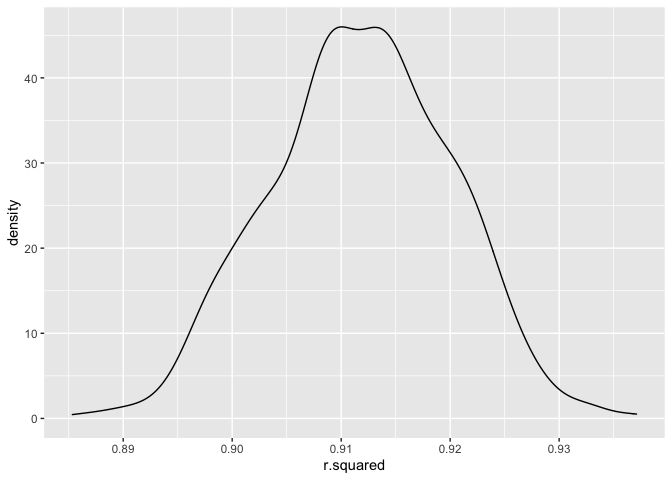

Data Science Homework 6
================
Thirsten Stockton
2022-12-03

# Problem 1

**Code to bring in data**

``` r
weather_df = 
  rnoaa::meteo_pull_monitors(
    c("USW00094728"),
    var = c("PRCP", "TMIN", "TMAX"), 
    date_min = "2017-01-01",
    date_max = "2017-12-31") %>%
  mutate(
    name = recode(id, USW00094728 = "CentralPark_NY"),
    tmin = tmin / 10,
    tmax = tmax / 10) %>%
  select(name, id, everything())
```

    ## Registered S3 method overwritten by 'hoardr':
    ##   method           from
    ##   print.cache_info httr

    ## using cached file: ~/Library/Caches/R/noaa_ghcnd/USW00094728.dly

    ## date created (size, mb): 2022-12-03 16:23:12 (8.428)

    ## file min/max dates: 1869-01-01 / 2022-12-31

***Plotting distribution of bootstapped r-sqaured estimates***

``` r
weather_df %>% 
  modelr::bootstrap(n = 1000) %>% 
  mutate(
    models = map(strap, ~lm(tmax ~ tmin, data = .x) ),
    results = map(models, broom::glance)) %>% 
  select(-strap, -models) %>% 
  unnest(results) %>% 
  ggplot(aes(x = r.squared)) + geom_density()
```

<!-- -->

***95% confidence interval for r-squared estimate***

``` r
rsq_bootstrap =
weather_df %>% 
  modelr::bootstrap(n = 1000) %>% 
  mutate(
    models = map(strap, ~lm(tmax ~ tmin, data = .x) ),
    results = map(models, broom::glance)) %>% 
  select(-strap, -models) %>% 
  unnest(results) 

quantile(rsq_bootstrap$r.squared, c(0.025, 0.975))
```

    ##      2.5%     97.5% 
    ## 0.8942312 0.9262429

The distribution of r-squared estimates shows a slight left skew and is
rather narrow. The estimated 95% confidence interval is (0.8937494,
0.9274768), though due to the skewed nature of the data, this may not be
the best estimate.

***Plotting distribution of $\log(\beta_0 * \beta1)$***

``` r
weather_df %>% 
  modelr::bootstrap(n = 1000) %>% 
  mutate(
    models = map(strap, ~lm(tmax ~ tmin, data = .x) ),
    results = map(models, broom::tidy)) %>% 
  select(-strap, -models) %>% 
  unnest(results) %>% 
  select(id = `.id`, term, estimate) %>% 
  pivot_wider(
    names_from = term, 
    values_from = estimate) %>% 
  rename(beta0 = `(Intercept)`, beta1 = tmin) %>% 
  mutate(log_b0b1 = log(beta0 * beta1)) %>% 
  ggplot(aes(x = log_b0b1)) + geom_density()
```

<!-- -->

***95% confidence interval for $\log(\beta_0 * \beta1)$ estimate***

``` r
log_betas_bootstrap =
weather_df %>% 
  modelr::bootstrap(n = 1000) %>% 
  mutate(
    models = map(strap, ~lm(tmax ~ tmin, data = .x) ),
    results = map(models, broom::tidy)) %>% 
  select(-strap, -models) %>% 
  unnest(results) %>% 
  select(id = `.id`, term, estimate) %>% 
  pivot_wider(
    names_from = term, 
    values_from = estimate) %>% 
  rename(beta0 = `(Intercept)`, beta1 = tmin) %>% 
  mutate(log_b0b1 = log(beta0 * beta1)) 


quantile(log_betas_bootstrap$log_b0b1, c(0.025, 0.975))
```

    ##     2.5%    97.5% 
    ## 1.963753 2.059984

Similar to the r-squared plot, this plot shows a slight left skew. The
95% confidence interval for this estimate is (1.962837, 2.059418), but
like the first estimate, the 95% CI may not be reliable due to skewness.

### Problem 2

### Reading in and cleaning data

``` r
homocide_df = 
  read_csv("https://raw.githubusercontent.com/washingtonpost/data-homicides/master/homicide-data.csv") %>%
  unite(city_state,c(city, state), sep = ", ", remove=FALSE) %>%
  filter(city_state != "Dallas, Tx", city_state != "Phoenix, AZ", city_state != "Kansas City, MO", city_state != "Tulsa, AL")  %>%
  filter(victim_race %in% c("White", "Black")) %>%
  mutate(victim_age = as.numeric(victim_age)) %>%
  mutate(crime = case_when(
    disposition %in% c("Closed without arrest", "Open/No arrest") ~ "1",
    disposition %in% c("Closed by arrest") ~ "0")) %>%
  mutate(crime = as.numeric(crime)) 
```

    ## Rows: 52179 Columns: 12
    ## ── Column specification ────────────────────────────────────────────────────────
    ## Delimiter: ","
    ## chr (9): uid, victim_last, victim_first, victim_race, victim_age, victim_sex...
    ## dbl (3): reported_date, lat, lon
    ## 
    ## ℹ Use `spec()` to retrieve the full column specification for this data.
    ## ℹ Specify the column types or set `show_col_types = FALSE` to quiet this message.

    ## Warning in mask$eval_all_mutate(quo): NAs introduced by coercion

### Logistic regression model for Baltimore, MD.

``` r
bmd_log= 
  homocide_df %>%
  filter(city_state == "Baltimore, MD") %>%
  glm(crime ~ victim_age + victim_race + victim_sex, family = binomial(), data = .)


bmd_log %>% 
  broom::tidy() %>%
  mutate(OR = exp(estimate)) %>%
  mutate(LCI = exp(estimate-(1.96*std.error))) %>%
  mutate(UCI = exp(estimate+(1.96*std.error))) %>%
  select(term, log_OR = estimate, OR, LCI, UCI) %>%
  filter(term == "victim_sexMale")
```

    ## # A tibble: 1 × 5
    ##   term           log_OR    OR   LCI   UCI
    ##   <chr>           <dbl> <dbl> <dbl> <dbl>
    ## 1 victim_sexMale  0.854  2.35  1.79  3.08

### Mapping to every city state

``` r
broom_tidy_function = function(data) {
  data %>%
    broom::tidy() %>%
    mutate(OR = exp(estimate)) %>%
    mutate(LCI = exp(estimate-(1.96*std.error))) %>%
    mutate(UCI = exp(estimate+(1.96*std.error))) %>%
    select(term, log_OR = estimate, OR, LCI, UCI) %>%
    filter(term == "victim_sexMale")
}

city_state_log =
  homocide_df %>%
  nest(data = -city_state) %>%
  mutate(log_models = map(data, ~glm(crime ~ victim_age + victim_race + victim_sex, family = binomial(), data = .))) %>%
  mutate(results = (map(log_models, broom_tidy_function ))) %>%
  select(city_state, results) %>%
    unnest(cols = results)

city_state_log
```

    ## # A tibble: 47 × 6
    ##    city_state      term               log_OR    OR   LCI   UCI
    ##    <chr>           <chr>               <dbl> <dbl> <dbl> <dbl>
    ##  1 Albuquerque, NM victim_sexMale -0.570     0.566 0.266  1.20
    ##  2 Atlanta, GA     victim_sexMale -0.0000771 1.00  0.683  1.46
    ##  3 Baltimore, MD   victim_sexMale  0.854     2.35  1.79   3.08
    ##  4 Baton Rouge, LA victim_sexMale  0.964     2.62  1.44   4.78
    ##  5 Birmingham, AL  victim_sexMale  0.139     1.15  0.759  1.74
    ##  6 Boston, MA      victim_sexMale  0.395     1.48  0.784  2.81
    ##  7 Buffalo, NY     victim_sexMale  0.653     1.92  1.07   3.45
    ##  8 Charlotte, NC   victim_sexMale  0.123     1.13  0.713  1.80
    ##  9 Chicago, IL     victim_sexMale  0.891     2.44  2.00   2.98
    ## 10 Cincinnati, OH  victim_sexMale  0.917     2.50  1.48   4.24
    ## # … with 37 more rows
    ## # ℹ Use `print(n = ...)` to see more rows

### Plot of OR’s and their 95% CI by city.

``` r
OR_plot =
city_state_log %>%
  ggplot(., aes (y = reorder(city_state, -OR), x= OR)) +
      geom_point(shape = 19, size=1) +
      geom_errorbarh(aes(xmin = LCI, xmax = UCI, height = 0.25)) +
      geom_vline(xintercept = 1, color = "purple", alpha = 0.5) 

OR_plot
```

<!-- -->

This plot shows the odds ratios comparing odds of a male victim having
their homicide go unsolved versus a female victim, by city. Looking at
this plot, we can see that most of the odds ratio were not significant.
Male victims tended to have higher odds of having their homicide go
unsolved across cities. New York City boasted the largest odds ratio,
but also had a fairly large confidence interval.
