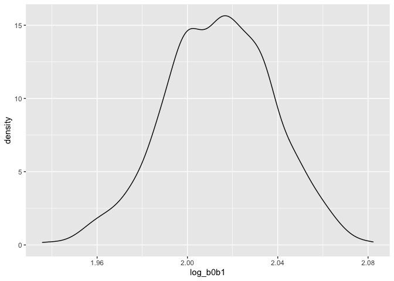

Data Science Homework 6
================
Thirsten Stockton
2022-12-03

# Problem 1

**Code to bring in data**

``` r
weather_df = 
  rnoaa::meteo_pull_monitors(
    c("USW00094728"),
    var = c("PRCP", "TMIN", "TMAX"), 
    date_min = "2017-01-01",
    date_max = "2017-12-31") %>%
  mutate(
    name = recode(id, USW00094728 = "CentralPark_NY"),
    tmin = tmin / 10,
    tmax = tmax / 10) %>%
  select(name, id, everything())
```

    ## Registered S3 method overwritten by 'hoardr':
    ##   method           from
    ##   print.cache_info httr

    ## using cached file: ~/Library/Caches/R/noaa_ghcnd/USW00094728.dly

    ## date created (size, mb): 2022-12-03 16:23:12 (8.428)

    ## file min/max dates: 1869-01-01 / 2022-12-31

***Plotting distribution of bootstapped r-sqaured estimates***

``` r
weather_df %>% 
  modelr::bootstrap(n = 1000) %>% 
  mutate(
    models = map(strap, ~lm(tmax ~ tmin, data = .x) ),
    results = map(models, broom::glance)) %>% 
  select(-strap, -models) %>% 
  unnest(results) %>% 
  ggplot(aes(x = r.squared)) + geom_density()
```

<!-- -->

***95% confidence interval for r-squared estimate***

``` r
rsq_bootstrap =
weather_df %>% 
  modelr::bootstrap(n = 1000) %>% 
  mutate(
    models = map(strap, ~lm(tmax ~ tmin, data = .x) ),
    results = map(models, broom::glance)) %>% 
  select(-strap, -models) %>% 
  unnest(results) 

quantile(rsq_bootstrap$r.squared, c(0.025, 0.975))
```

    ##      2.5%     97.5% 
    ## 0.8945400 0.9272775

The distribution of r-squared estimates shows a slight left skew and is
rather narrow. The estimated 95% confidence interval is (0.8937494,
0.9274768), though due to the skewed nature of the data, this may not be
the best estimate.

***Plotting distribution of $\log(\beta_0 * \beta1)$***

``` r
weather_df %>% 
  modelr::bootstrap(n = 1000) %>% 
  mutate(
    models = map(strap, ~lm(tmax ~ tmin, data = .x) ),
    results = map(models, broom::tidy)) %>% 
  select(-strap, -models) %>% 
  unnest(results) %>% 
  select(id = `.id`, term, estimate) %>% 
  pivot_wider(
    names_from = term, 
    values_from = estimate) %>% 
  rename(beta0 = `(Intercept)`, beta1 = tmin) %>% 
  mutate(log_b0b1 = log(beta0 * beta1)) %>% 
  ggplot(aes(x = log_b0b1)) + geom_density()
```

<!-- -->

***95% confidence interval for $\log(\beta_0 * \beta1)$ estimate***

``` r
log_betas_bootstrap =
weather_df %>% 
  modelr::bootstrap(n = 1000) %>% 
  mutate(
    models = map(strap, ~lm(tmax ~ tmin, data = .x) ),
    results = map(models, broom::tidy)) %>% 
  select(-strap, -models) %>% 
  unnest(results) %>% 
  select(id = `.id`, term, estimate) %>% 
  pivot_wider(
    names_from = term, 
    values_from = estimate) %>% 
  rename(beta0 = `(Intercept)`, beta1 = tmin) %>% 
  mutate(log_b0b1 = log(beta0 * beta1)) 


quantile(log_betas_bootstrap$log_b0b1, c(0.025, 0.975))
```

    ##     2.5%    97.5% 
    ## 1.966627 2.060562

Similar to the r-squared plot, this plot shows a slight left skew. The
95% confidence interval for this estimate is (1.962837, 2.059418), but
like the first estimate, the 95% CI may not be reliable due to skewness.

### Problem 2

### Reading in and cleaning data

``` r
homocide_df = 
  read_csv("https://raw.githubusercontent.com/washingtonpost/data-homicides/master/homicide-data.csv") %>%
  unite(city_state,c(city, state), sep = ", ", remove=FALSE) %>%
  filter(city_state != "Dallas, Tx", city_state != "Phoenix, AZ", city_state != "Kansas City, MO", city_state != "Tulsa, AL")  %>%
  filter(victim_race %in% c("White", "Black")) %>%
  mutate(victim_age = as.numeric(victim_age)) %>%
  mutate(crime = case_when(
    disposition %in% c("Closed without arrest", "Open/No arrest") ~ "1",
    disposition %in% c("Closed by arrest") ~ "0")) %>%
  mutate(crime = as.numeric(crime)) 
```

    ## Rows: 52179 Columns: 12
    ## ── Column specification ────────────────────────────────────────────────────────
    ## Delimiter: ","
    ## chr (9): uid, victim_last, victim_first, victim_race, victim_age, victim_sex...
    ## dbl (3): reported_date, lat, lon
    ## 
    ## ℹ Use `spec()` to retrieve the full column specification for this data.
    ## ℹ Specify the column types or set `show_col_types = FALSE` to quiet this message.

    ## Warning in mask$eval_all_mutate(quo): NAs introduced by coercion

### Logistic regression model for Baltimore, MD.

``` r
bmd_log= 
  homocide_df %>%
  filter(city_state == "Baltimore, MD") %>%
  glm(crime ~ victim_age + victim_race + victim_sex, family = binomial(), data = .)


bmd_log %>% 
  broom::tidy() %>%
  mutate(OR = exp(estimate)) %>%
  mutate(LCI = exp(estimate-(1.96*std.error))) %>%
  mutate(UCI = exp(estimate+(1.96*std.error))) %>%
  select(term, log_OR = estimate, OR, LCI, UCI) %>%
  filter(term == "victim_sexMale")
```

    ## # A tibble: 1 × 5
    ##   term           log_OR    OR   LCI   UCI
    ##   <chr>           <dbl> <dbl> <dbl> <dbl>
    ## 1 victim_sexMale  0.854  2.35  1.79  3.08

### Mapping to every city state

``` r
broom_tidy_function = function(data) {
  data %>%
    broom::tidy() %>%
    mutate(OR = exp(estimate)) %>%
    mutate(LCI = exp(estimate-(1.96*std.error))) %>%
    mutate(UCI = exp(estimate+(1.96*std.error))) %>%
    select(term, log_OR = estimate, OR, LCI, UCI) %>%
    filter(term == "victim_sexMale")
}

city_state_log =
  homocide_df %>%
  nest(data = -city_state) %>%
  mutate(log_models = map(data, ~glm(crime ~ victim_age + victim_race + victim_sex, family = binomial(), data = .))) %>%
  mutate(results = (map(log_models, broom_tidy_function ))) %>%
  select(city_state, results) %>%
    unnest(cols = results)

city_state_log
```

    ## # A tibble: 47 × 6
    ##    city_state      term               log_OR    OR   LCI   UCI
    ##    <chr>           <chr>               <dbl> <dbl> <dbl> <dbl>
    ##  1 Albuquerque, NM victim_sexMale -0.570     0.566 0.266  1.20
    ##  2 Atlanta, GA     victim_sexMale -0.0000771 1.00  0.683  1.46
    ##  3 Baltimore, MD   victim_sexMale  0.854     2.35  1.79   3.08
    ##  4 Baton Rouge, LA victim_sexMale  0.964     2.62  1.44   4.78
    ##  5 Birmingham, AL  victim_sexMale  0.139     1.15  0.759  1.74
    ##  6 Boston, MA      victim_sexMale  0.395     1.48  0.784  2.81
    ##  7 Buffalo, NY     victim_sexMale  0.653     1.92  1.07   3.45
    ##  8 Charlotte, NC   victim_sexMale  0.123     1.13  0.713  1.80
    ##  9 Chicago, IL     victim_sexMale  0.891     2.44  2.00   2.98
    ## 10 Cincinnati, OH  victim_sexMale  0.917     2.50  1.48   4.24
    ## # … with 37 more rows
    ## # ℹ Use `print(n = ...)` to see more rows

### Plot of OR’s and their 95% CI by city.

``` r
OR_plot =
city_state_log %>%
  ggplot(., aes (y = reorder(city_state, -OR), x= OR)) +
      geom_point(shape = 19, size=1) +
      geom_errorbarh(aes(xmin = LCI, xmax = UCI, height = 0.25)) +
      geom_vline(xintercept = 1, color = "purple", alpha = 0.5) 

OR_plot
```

<!-- -->

This plot shows the odds ratios comparing odds of a male victim having
their homicide go unsolved versus a female victim, by city. Looking at
this plot, we can see that most of the odds ratio were not significant.
Male victims tended to have higher odds of having their homicide go
unsolved across cities. New York City boasted the largest odds ratio,
but also had a fairly large confidence interval.

### Problem 3

### **Birthweight regression model using LASSO**

### Bringing in and cleaning birthweight dataset for LASSO Regression, selecting 200 observations randomly for

``` r
bwt_df = 
  read_csv("./birthweight.csv") %>% 
  janitor::clean_names() %>%
  mutate(
    babysex = as.factor(babysex),
    babysex = fct_recode(babysex, "male" = "1", "female" = "2"),
    frace = as.factor(frace),
    frace = fct_recode(frace, "white" = "1", "black" = "2", "asian" = "3", 
                       "puerto rican" = "4", "other" = "8"),
    malform = as.logical(malform),
    mrace = as.factor(mrace),
    mrace = fct_recode(mrace, "white" = "1", "black" = "2", "asian" = "3", 
                       "puerto rican" = "4")) 
```

    ## Rows: 4342 Columns: 20
    ## ── Column specification ────────────────────────────────────────────────────────
    ## Delimiter: ","
    ## dbl (20): babysex, bhead, blength, bwt, delwt, fincome, frace, gaweeks, malf...
    ## 
    ## ℹ Use `spec()` to retrieve the full column specification for this data.
    ## ℹ Specify the column types or set `show_col_types = FALSE` to quiet this message.

``` r
bwt_df =
  tibble::rowid_to_column(bwt_df, "id")

bwt_df
```

    ## # A tibble: 4,342 × 21
    ##       id babysex bhead blength   bwt delwt fincome frace gaweeks malform menar…¹
    ##    <int> <fct>   <dbl>   <dbl> <dbl> <dbl>   <dbl> <fct>   <dbl> <lgl>     <dbl>
    ##  1     1 female     34      51  3629   177      35 white    39.9 FALSE        13
    ##  2     2 male       34      48  3062   156      65 black    25.9 FALSE        14
    ##  3     3 female     36      50  3345   148      85 white    39.9 FALSE        12
    ##  4     4 male       34      52  3062   157      55 white    40   FALSE        14
    ##  5     5 female     34      52  3374   156       5 white    41.6 FALSE        13
    ##  6     6 male       33      52  3374   129      55 white    40.7 FALSE        12
    ##  7     7 female     33      46  2523   126      96 black    40.3 FALSE        14
    ##  8     8 female     33      49  2778   140       5 white    37.4 FALSE        12
    ##  9     9 male       36      52  3515   146      85 white    40.3 FALSE        11
    ## 10    10 male       33      50  3459   169      75 black    40.7 FALSE        12
    ## # … with 4,332 more rows, 10 more variables: mheight <dbl>, momage <dbl>,
    ## #   mrace <fct>, parity <dbl>, pnumlbw <dbl>, pnumsga <dbl>, ppbmi <dbl>,
    ## #   ppwt <dbl>, smoken <dbl>, wtgain <dbl>, and abbreviated variable name
    ## #   ¹​menarche
    ## # ℹ Use `print(n = ...)` to see more rows, and `colnames()` to see all variable names

``` r
bwt_df_train =
  sample_n(bwt_df, 200)


bwt_df_test = 
  anti_join(bwt_df, bwt_df_train, by = "id")

bwt_df_test =
 bwt_df_test  %>%
  select(-id)


bwt_df_train =
  bwt_df_train %>%
    select(-id)

bwt_df_train
```

    ## # A tibble: 200 × 20
    ##    babysex bhead blength   bwt delwt fincome frace gaweeks malform menarche
    ##    <fct>   <dbl>   <dbl> <dbl> <dbl>   <dbl> <fct>   <dbl> <lgl>      <dbl>
    ##  1 male       35      51  3062   162      25 black    39   FALSE         14
    ##  2 female     33      50  2920   168      25 black    43.7 FALSE         12
    ##  3 male       35      51  3430   140      35 white    40.6 FALSE         11
    ##  4 female     36      46  2608   120      85 white    41.1 FALSE         13
    ##  5 male       35      46  3203   126      55 white    39   FALSE         12
    ##  6 female     34      50  3232   155      25 white    40   FALSE         13
    ##  7 female     32      48  2608   138      85 black    43   FALSE         11
    ##  8 male       34      48  2920   143      65 black    39   FALSE         12
    ##  9 female     34      48  3175   139       5 black    37.1 FALSE         12
    ## 10 female     35      50  3090   174      15 white    42   FALSE         13
    ## # … with 190 more rows, and 10 more variables: mheight <dbl>, momage <dbl>,
    ## #   mrace <fct>, parity <dbl>, pnumlbw <dbl>, pnumsga <dbl>, ppbmi <dbl>,
    ## #   ppwt <dbl>, smoken <dbl>, wtgain <dbl>
    ## # ℹ Use `print(n = ...)` to see more rows, and `colnames()` to see all variable names

``` r
bwt_df_test
```

    ## # A tibble: 4,142 × 20
    ##    babysex bhead blength   bwt delwt fincome frace gaweeks malform menarche
    ##    <fct>   <dbl>   <dbl> <dbl> <dbl>   <dbl> <fct>   <dbl> <lgl>      <dbl>
    ##  1 female     34      51  3629   177      35 white    39.9 FALSE         13
    ##  2 male       34      48  3062   156      65 black    25.9 FALSE         14
    ##  3 female     36      50  3345   148      85 white    39.9 FALSE         12
    ##  4 male       34      52  3062   157      55 white    40   FALSE         14
    ##  5 female     34      52  3374   156       5 white    41.6 FALSE         13
    ##  6 male       33      52  3374   129      55 white    40.7 FALSE         12
    ##  7 female     33      46  2523   126      96 black    40.3 FALSE         14
    ##  8 female     33      49  2778   140       5 white    37.4 FALSE         12
    ##  9 male       36      52  3515   146      85 white    40.3 FALSE         11
    ## 10 male       33      50  3459   169      75 black    40.7 FALSE         12
    ## # … with 4,132 more rows, and 10 more variables: mheight <dbl>, momage <dbl>,
    ## #   mrace <fct>, parity <dbl>, pnumlbw <dbl>, pnumsga <dbl>, ppbmi <dbl>,
    ## #   ppwt <dbl>, smoken <dbl>, wtgain <dbl>
    ## # ℹ Use `print(n = ...)` to see more rows, and `colnames()` to see all variable names

### Finding optimal lambda

``` r
y = bwt_df_train$bwt
x1 = model.matrix(bwt ~ ., bwt_df_train)[,-1]


val_model =
  cv.glmnet(x1, y)

opt_lambda = 
  val_model$lambda.min

opt_lambda
```

    ## [1] 13.63259

### Fitting lasso regression model

``` r
lasso_bwt_train =
  glmnet(x1, y, lambda = opt_lambda)
```

### Results of our model

``` r
lasso_bwt_train %>%
  broom::tidy()
```

    ## # A tibble: 9 × 5
    ##   term         step  estimate lambda dev.ratio
    ##   <chr>       <dbl>     <dbl>  <dbl>     <dbl>
    ## 1 (Intercept)     1 -7112.      13.6     0.737
    ## 2 bhead           1   109.      13.6     0.737
    ## 3 blength         1    99.0     13.6     0.737
    ## 4 delwt           1     0.763   13.6     0.737
    ## 5 gaweeks         1     9.76    13.6     0.737
    ## 6 menarche        1    -6.34    13.6     0.737
    ## 7 mheight         1    19.5     13.6     0.737
    ## 8 mraceblack      1   -58.4     13.6     0.737
    ## 9 wtgain          1     1.31    13.6     0.737

### Plot of predictions versus residuals

``` r
predicted =
  predict(lasso_bwt_train, s = opt_lambda, newx = x1)

predicted
```

    ##            s1
    ## 1   3328.4261
    ## 2   3196.5872
    ## 3   3278.5014
    ## 4   2973.0559
    ## 5   2940.0780
    ## 6   3206.3412
    ## 7   2739.0130
    ## 8   2934.7127
    ## 9   2966.2550
    ## 10  3397.3984
    ## 11  3078.6955
    ## 12  3610.6664
    ## 13  3358.8524
    ## 14  3095.6154
    ## 15  3190.7888
    ## 16  3126.9975
    ## 17  3356.2769
    ## 18  2862.3423
    ## 19  3138.4067
    ## 20  2656.0234
    ## 21  3519.9172
    ## 22  3202.6793
    ## 23  2860.9146
    ## 24  3672.5718
    ## 25  3322.6715
    ## 26  3365.0019
    ## 27  2858.1832
    ## 28  3255.6711
    ## 29  3208.3818
    ## 30  2981.2839
    ## 31  2841.0445
    ## 32  2973.4332
    ## 33  2932.5448
    ## 34  4043.7233
    ## 35  3000.1529
    ## 36  2675.3693
    ## 37  3550.6823
    ## 38  2378.8206
    ## 39  2761.0783
    ## 40  2997.8186
    ## 41  3782.3301
    ## 42  2854.2349
    ## 43  3541.8326
    ## 44  3309.4409
    ## 45  2923.6719
    ## 46  3253.0011
    ## 47  3091.2273
    ## 48  3609.1893
    ## 49  3286.0572
    ## 50  3150.7344
    ## 51  2905.6346
    ## 52  3058.7722
    ## 53  2655.0711
    ## 54  2702.5880
    ## 55   660.0519
    ## 56  3425.8852
    ## 57  3267.0719
    ## 58  3296.1886
    ## 59  3255.5492
    ## 60  3322.0661
    ## 61  2970.7876
    ## 62  3548.9639
    ## 63  3157.7615
    ## 64  2803.9945
    ## 65  3051.5708
    ## 66  3048.5789
    ## 67  2784.6482
    ## 68  2935.2373
    ## 69  3586.8992
    ## 70  3496.0529
    ## 71  3528.2119
    ## 72  3397.2385
    ## 73  3788.8690
    ## 74  2493.4745
    ## 75  3353.3285
    ## 76  3349.8791
    ## 77  3182.5496
    ## 78  3690.7982
    ## 79  3206.0614
    ## 80  3145.7261
    ## 81  4202.2873
    ## 82  2714.0544
    ## 83  3626.7025
    ## 84  3225.8043
    ## 85  2772.0368
    ## 86  2877.3501
    ## 87  3466.8361
    ## 88  2953.1399
    ## 89  2792.9506
    ## 90  3064.5998
    ## 91  3130.5400
    ## 92  2843.5897
    ## 93  2552.8999
    ## 94  3575.1293
    ## 95  3227.8593
    ## 96  3788.1997
    ## 97  2697.8815
    ## 98  3099.9178
    ## 99  2220.4284
    ## 100 3812.7282
    ## 101 3005.9740
    ## 102 3156.4966
    ## 103 2872.7168
    ## 104 2643.0120
    ## 105 3049.0448
    ## 106 3596.2498
    ## 107 3542.0228
    ## 108 3430.6898
    ## 109 3106.0722
    ## 110 3348.1877
    ## 111 2977.8314
    ## 112 3396.3335
    ## 113 3550.4763
    ## 114 2749.4404
    ## 115 2933.9557
    ## 116 3443.7800
    ## 117 3024.1112
    ## 118 3457.7395
    ## 119 2822.9476
    ## 120 3755.3238
    ## 121 2969.4893
    ## 122 3415.2683
    ## 123 3382.3235
    ## 124 2126.6610
    ## 125 2344.2820
    ## 126 3596.3806
    ## 127 2439.7021
    ## 128 3111.3533
    ## 129 3094.5030
    ## 130 3680.7315
    ## 131 2944.7791
    ## 132 3127.1792
    ## 133 2960.9320
    ## 134 3001.2968
    ## 135 3196.5463
    ## 136 2990.5202
    ## 137 3215.9698
    ## 138 2466.7884
    ## 139 3274.0151
    ## 140 3193.5725
    ## 141 2921.5953
    ## 142 3058.2999
    ## 143 3324.3258
    ## 144 4000.1960
    ## 145 3166.4362
    ## 146 2508.5055
    ## 147 3011.6353
    ## 148 2500.9116
    ## 149 2508.4982
    ## 150 3157.5685
    ## 151 1113.8297
    ## 152 3301.8557
    ## 153 3043.3171
    ## 154 3135.5979
    ## 155 3361.8990
    ## 156 2459.1196
    ## 157 3187.6486
    ## 158 4207.6397
    ## 159 2789.9034
    ## 160 3133.3560
    ## 161 3579.9726
    ## 162 2968.9591
    ## 163 2726.6157
    ## 164 2459.2929
    ## 165 3323.3670
    ## 166 2979.9142
    ## 167 3244.3301
    ## 168 2902.3163
    ## 169 2946.9823
    ## 170 3691.7483
    ## 171 3169.6407
    ## 172 3637.2760
    ## 173 3101.9941
    ## 174 3547.5143
    ## 175 3371.9841
    ## 176 3052.1579
    ## 177 3580.0032
    ## 178 1755.3524
    ## 179 3385.3178
    ## 180 3365.3457
    ## 181 3709.0177
    ## 182 3067.1306
    ## 183 3310.1839
    ## 184 3552.9454
    ## 185 2961.1922
    ## 186 3476.9990
    ## 187 3163.6562
    ## 188 3265.9476
    ## 189 3386.2763
    ## 190 3664.0915
    ## 191 2913.4080
    ## 192 2214.1819
    ## 193 2777.4233
    ## 194 2483.3757
    ## 195 3345.5021
    ## 196 2575.6420
    ## 197 3077.4112
    ## 198 2755.5974
    ## 199 2965.1834
    ## 200 2514.7670

``` r
residual =
  predicted - y

residual
```

    ##               s1
    ## 1    266.4260584
    ## 2    276.5871655
    ## 3   -151.4986460
    ## 4    365.0558899
    ## 5   -262.9220127
    ## 6    -25.6588101
    ## 7    131.0129714
    ## 8     14.7126625
    ## 9   -208.7450268
    ## 10   307.3984137
    ## 11   -96.3045039
    ## 12   123.6663770
    ## 13   211.8524378
    ## 14  -249.3846122
    ## 15  -154.2111545
    ## 16  -105.0025488
    ## 17  -725.7231482
    ## 18   282.3422772
    ## 19   190.4067135
    ## 20  -348.9766083
    ## 21   202.9171896
    ## 22    84.6793179
    ## 23  -371.0853797
    ## 24   -97.4281807
    ## 25   289.6714515
    ## 26  -404.9980945
    ## 27  -316.8167627
    ## 28   -33.3288708
    ## 29   430.3817625
    ## 30     4.2839480
    ## 31   460.0444580
    ## 32    -3.5667532
    ## 33   522.5447554
    ## 34   102.7232623
    ## 35    52.1529174
    ## 36    95.3693427
    ## 37   -78.3177495
    ## 38   -59.1794487
    ## 39    11.0782693
    ## 40    77.8186161
    ## 41  -186.6699202
    ## 42  -150.7651086
    ## 43   394.8326437
    ## 44    77.4409486
    ## 45    60.6718588
    ## 46   220.0011332
    ## 47   313.2272604
    ## 48   491.1892578
    ## 49    54.0572315
    ## 50   230.7343529
    ## 51   325.6346264
    ## 52   138.7722319
    ## 53    -9.9288937
    ## 54  -245.4120485
    ## 55  -388.9481495
    ## 56  -344.1147511
    ## 57   489.0719076
    ## 58    64.1886414
    ## 59   165.5492095
    ## 60   119.0660530
    ## 61   135.7876176
    ## 62  -675.0361049
    ## 63   464.7615099
    ## 64    -3.0054810
    ## 65   188.5708339
    ## 66   -41.4210989
    ## 67  -163.3518283
    ## 68   -41.7626761
    ## 69  -127.1008211
    ## 70  -103.9470583
    ## 71  -695.7880655
    ## 72   108.2384925
    ## 73   273.8690266
    ## 74  -114.5254796
    ## 75  -190.6715082
    ## 76  -732.1208991
    ## 77   149.5495885
    ## 78  -561.2018116
    ## 79  -478.9385719
    ## 80   225.7260655
    ## 81  -305.7127295
    ## 82    21.0544217
    ## 83   -30.2975447
    ## 84    22.8043430
    ## 85   617.0368409
    ## 86   -42.6499478
    ## 87   659.8361356
    ## 88   175.1399443
    ## 89   127.9505509
    ## 90    59.5998330
    ## 91   210.5400138
    ## 92  -133.4102650
    ## 93  -169.1001241
    ## 94  -308.8706777
    ## 95   392.8592868
    ## 96   -10.8003484
    ## 97     4.8814840
    ## 98  -387.0821980
    ## 99   604.4284288
    ## 100  325.7282473
    ## 101 -169.0259851
    ## 102  -46.5033697
    ## 103 -132.2832345
    ## 104   35.0120168
    ## 105 -125.9551868
    ## 106  -60.7502048
    ## 107 -256.9772022
    ## 108  482.6897776
    ## 109  186.0722419
    ## 110 -166.8122842
    ## 111 -282.1685830
    ## 112 -317.6664962
    ## 113   35.4763422
    ## 114   -0.5595502
    ## 115 -128.0442512
    ## 116  183.7800346
    ## 117   -8.8887764
    ## 118  310.7395390
    ## 119  129.9475957
    ## 120  296.3238007
    ## 121  -63.5107269
    ## 122  -99.7317323
    ## 123 -104.6765056
    ## 124  255.6610284
    ## 125 -235.7180419
    ## 126 -230.6193987
    ## 127  -26.2979237
    ## 128  -91.6466979
    ## 129 -364.4969810
    ## 130   -4.2685351
    ## 131  222.7791421
    ## 132  -75.8208182
    ## 133   97.9320065
    ## 134 -201.7032462
    ## 135  -63.4536545
    ## 136   42.5202317
    ## 137  153.9697683
    ## 138   85.7884083
    ## 139  -14.9849459
    ## 140  585.5725138
    ## 141 -281.4047079
    ## 142  195.2998999
    ## 143 -729.6742359
    ## 144 -507.8040496
    ## 145  246.4361776
    ## 146  -14.4944879
    ## 147 -503.3646722
    ## 148  430.9116418
    ## 149 -638.5018470
    ## 150 -244.4315274
    ## 151 -133.1703054
    ## 152   69.8557471
    ## 153   66.3171156
    ## 154 -549.4021388
    ## 155  -40.1009719
    ## 156  191.1195686
    ## 157  267.6486273
    ## 158  153.6396925
    ## 159 -187.0966067
    ## 160  -13.6440202
    ## 161  -49.0273798
    ## 162  161.9590914
    ## 163 -250.3843291
    ## 164  531.2929298
    ## 165  403.3669966
    ## 166 -252.0857614
    ## 167  296.3300676
    ## 168  265.3163454
    ## 169   -1.0176673
    ## 170 -390.2517090
    ## 171 -175.3592824
    ## 172  122.2760347
    ## 173 -215.0058972
    ## 174 -166.4857494
    ## 175 -143.0159009
    ## 176  -37.8421425
    ## 177 -161.9968400
    ## 178  508.3523524
    ## 179  210.3178468
    ## 180 -433.6543347
    ## 181   -4.9822988
    ## 182 -277.8694383
    ## 183   78.1839477
    ## 184  -19.0545897
    ## 185 -298.8078129
    ## 186  216.9990254
    ## 187  271.6561910
    ## 188 -108.0523726
    ## 189  -15.7237183
    ## 190   35.0915491
    ## 191  -91.5919858
    ## 192  655.1818529
    ## 193   27.4232981
    ## 194   17.3756767
    ## 195    0.5020787
    ## 196   80.6420435
    ## 197 -267.5887506
    ## 198  -51.4026390
    ## 199   17.1833766
    ## 200 -178.2329758
